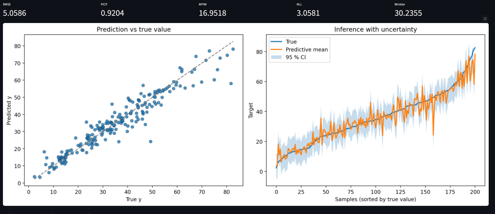
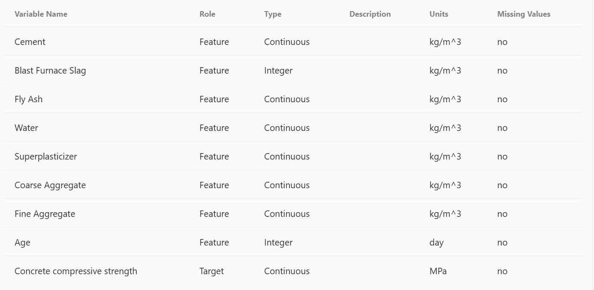

# Bayesian Neural Network Implementations
[](https://www.python.org/)
[](https://github.com/astral-sh/uv)
[](LICENSE)




Reference implementations and clear documentation of state-of-the-art Bayesian Neural Network (BNN) methods. Suited for safety-critical and high-stakes applications where predictive uncertainty matters more than a single point estimate.


## Implemented Methods

| Method | Description |
|--------|-------------|
| **ABC-SS** | Approximate Bayesian Computation by Subset Simulation |
| **HMC** | Hamiltonian Monte Carlo |
| **MC Dropout** | Monte Carlo Dropout |
| **PBP** | Probabilistic Backpropagation |
| **VI-BB** | Variational Inference for Bayesian Neural Networks (Bayes by Backprop) |

---

## Repository Structure

```
bayesian-nn/
├── src/
│   ├── notebooks/     # Explanatory notebooks per method
│   │   ├── abc_ss
│   │   ├── abcss_hmc_vi
│   │   ├── hmc
│   │   ├── mc_dropout
│   │   ├── pbp
│   │   └── vi_bbb
│   ├── packages/     # Reusable BNN algorithm implementations (see below)
│   │   ├── abc_ss
│   │   ├── hmc
│   │   ├── mc_dropout
│   │   ├── pbp
│   │   └── vi_bb
│   └── demo/         # Streamlit demo application
├── dataset/          # Default dataset and assets
└── pyproject.toml
```

### The `src/packages` Directory

`src/packages` holds the core BNN implementations as importable Python packages. Each subpackage provides a **model**, a **config** (Pydantic), and a consistent interface for training and prediction. The demo and notebooks depend on these packages.

| Package | Main exports | Role |
|---------|--------------|------|
| **abc_ss** | `ABCSubSim`, `ABCSSConfig` | Approximate Bayesian Computation via subset simulation for posterior sampling. |
| **hmc** | `HMCNet`, `HMCConfig`, `sample_hmc`, `predict_hmc` | Hamiltonian Monte Carlo sampling for Bayesian neural networks (e.g. via hamiltorch). |
| **mc_dropout** | `MCDropoutNet`, `MCDropoutConfig`, `train_mc_dropout`, `predict_mc_dropout` | Monte Carlo Dropout: uncertainty from multiple forward passes with dropout enabled at test time. |
| **pbp** | `PBP_net`, `PBP`, `PBPConfig`, `Network`, `Network_layer`, `Prior` | Probabilistic Backpropagation: analytical approximate inference over network weights. |
| **vi_bb** | `BayesianMLP`, `DenseVariational`, `VIBBConfig`, `nll_gaussian` | Variational inference (Bayes by Backprop) with reparameterized Gaussian posteriors. |

Use these packages in your own scripts by importing from `src.packages` (with the project root on `PYTHONPATH`) or by installing the project as a package.

---

## Running the Demo

The project includes a **Justfile** recipe that runs an interactive Streamlit demo on the **Concrete Compressive Strength** dataset.

### Prerequisites

- **Python** >= 3.14 (see `pyproject.toml`)
- **just** — command runner. On Ubuntu/Debian: `sudo apt install just`
- **uv** — Python environment and dependency manager: [github.com/astral-sh/uv](https://github.com/astral-sh/uv)

### Launch

From the repository root:

```bash
just demo
```

This runs:

```bash
uv sync
uv run streamlit run ./src/demo/streamlit_app.py
```

### Demo Features

- Load and preprocess tabular data (default or user-uploaded).
- Choose a BNN model: MC Dropout, VI-BB, PBP, HMC, or ABC-SS.
- Tune hyperparameters from the sidebar.
- Train and inspect:
  - Metrics: RMSE, PCIP, MPIW, NLL, Winkler
  - Prediction plots with uncertainty.

#### Metrics shown in the Streamlit demo

For the probabilistic predictions, the demo reports:

- **RMSE**: Root-mean-squared error between \(y_{\text{true}}\) and the predictive mean \(y_{\text{pred}}\). It measures point-estimate accuracy.
- **PICP**: Prediction Interval Coverage Probability, i.e. the fraction of targets that fall inside the central predictive interval at a given confidence level (e.g. 95 %).
- **MPIW**: Mean Prediction Interval Width, i.e. the average width of that predictive interval. Narrower intervals mean sharper (more confident) predictions.
- **NLL**: Gaussian Negative Log-Likelihood under \(\mathcal{N}(y_{\text{pred}}, \sigma^2)\). It trades off accuracy and calibration of the predictive uncertainty.
- **Winkler**: Winkler score at level \(\alpha\), which combines interval width and coverage into a single proper scoring rule (penalising intervals that are too wide or that miss the true value).

### Optimization With Optuna

The demo includes a built-in Optuna workflow to tune each Bayesian model automatically.

For every trial, the app:
- Samples model-specific hyperparameters from a dedicated search space (different ranges for MC Dropout, VI-BB, PBP, HMC, and ABC-SS).
- Trains the selected model on the current train/test split.
- Computes probabilistic metrics (`RMSE`, `MAE`, `PICP`, `MPIW`, `NLL`, `Winkler`).
- Stores all metrics in the trial metadata and returns one or more optimization objectives.

Single-objective and multi-objective modes are both supported:
- **Single objective** uses a `TPESampler` and returns one best trial.
- **Multi-objective** uses `NSGAIISampler` and returns a Pareto front of non-dominated trials.

The objective can be selected from:
- `RMSE`, `MAE`, `MPIW`, `NLL`, `Winkler`, or **PICP loss** where  
  \[
  \text{PICP loss} = (\text{PICP} - (1-\alpha))^2
  \]
  to penalize miscalibration relative to the target coverage level.

To improve robustness during tuning, failed runs are converted to **pruned** trials instead of stopping the study.

After optimization, the app shows:
- A complete table of finished trials (objectives, metrics, and sampled parameters).
- Best-trial details (single-objective) or Pareto-front summaries (multi-objective).
- Diagnostic plots (optimization history, parameter importances, parallel coordinates).
- In single-objective mode, an inference view re-runs the best trial and visualizes predictive uncertainty.

### Default Dataset

With **"Use default dataset"** selected, the app loads the [Concrete Compressive Strength](https://archive.ics.uci.edu/dataset/165/concrete+compressive+strength) dataset from `dataset/Concrete_Data.xls`, so you can try all models without preparing data.



You can also upload your own file (CSV, XLS, or XLSX) and run the same training and evaluation pipeline.

---
## Interesting papers 

- [Physics-guided Bayesian neural networks by ABC-SS: Application to reinforced concrete columns](https://www.sciencedirect.com/science/article/abs/pii/S0952197622007801#preview-section-snippets)
  
- [Uncertainty quantification in Neural Networks by Approximate Bayesian Computation: Application to fatigue in composite materials](https://www.sciencedirect.com/science/article/pii/S0952197621003596)
  
- [Approximate Bayesian Computation by Subset Simulation](https://arxiv.org/abs/1404.6225)

- [MCMC using Hamiltonian dynamics](https://arxiv.org/abs/1206.1901)

- [The No-U-Turn Sampler: Adaptively Setting Path Lengths in Hamiltonian Monte Carlo](https://arxiv.org/abs/1111.4246)

- [Dropout as a Bayesian Approximation: Representing Model Uncertainty in Deep Learning](https://arxiv.org/abs/1506.02142)

- [Probabilistic Backpropagation for Scalable Learning of Bayesian Neural Networks](https://arxiv.org/abs/1502.05336)

- [Weight Uncertainty in Neural Networks (Blundell, Cornebise, Kavukcuoglu & Wierstra, 2015).](https://arxiv.org/abs/1505.05424)


## License

MIT License. Copyright (c) 2026 Christian Berdejo Sánchez.

See [LICENSE](LICENSE) for the full text.
